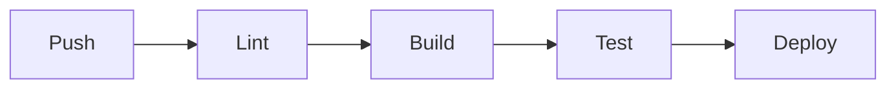
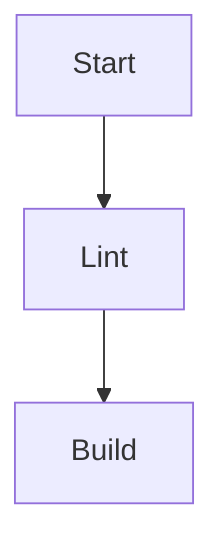

# 利用サンプル

## 重要なキーワード一覧

本書で使用する重要なキーワードについて説明します。

## Pandoc

**Pandoc**は、様々なマークアップ形式間でドキュメントを変換するためのコマンドラインツールです。

### 特徴

- **多様な入力形式** Markdown、LaTeX、HTML、Word docx など
- **豊富な出力形式** PDF、EPUB、HTML、Word docx など
- **拡張可能** Lua フィルターによるカスタマイズ
- **高品質な出力** 学術論文レベルの品質

### 使用例

```bash
# MarkdownからEPUBへの変換
pandoc input.md -o output.epub

# 複数ファイルの結合と変換
pandoc chapter*.md -o book.pdf

# CSSスタイルの適用
pandoc input.md --css=style.css -o output.html
```

## Markdown

**Markdown** は、軽量マークアップ言語の 1 つです。

### 基本構文

```markdown
# 見出し1
## 見出し2

**太字** *斜体*

- リスト項目1
- リスト項目2

[リンク](https://example.com)


```

[リンク](https://example.com)


### 拡張構文

本プロジェクトでは、次の拡張機能を使用します。

#### テーブル

GitHub スタイルのテーブル記法を利用します。

```markdown
+-------+-------+
| Header| Header|
+=======+=======+
| cell  | cell  |
+--+----+-------+
|^ | cell spanning
+--+----+-------+
``` 

| TH 左寄せ | TH 中央寄せ | TH 右寄せ |
| :--- | :---: | ---: |
| TD | TD | TD |
| TD | TD | TD |


- **コードブロック** シンタックスハイライト対応
- **数式** LaTeX 記法による数式表現
- **脚注** 学術的な文書に対応

#### 脚注の使用方法

Pandoc の脚注は `[^1]` と脚注定義 `[^1]: 補足内容` という二行構成で書けます[^1]。EPUB では脚注番号がリンクになり、読者はタップで往復できます。複数回参照したい場合は同じ脚注番号を使うだけで自動的に逆リンクが張られるため、HTML を手書きするより安全です[^2]。

```markdown
本文中での参照[^1]と、複数回の参照[^2]も可能です[^2]。

[^1]: これは最初の脚注です。
[^2]: この脚注は複数回参照されています。
```

[^1]: これは最初の脚注の例です。
[^2]: この脚注は複数回参照されています。

## EPUB

**EPUB**は、電子書籍の標準的なファイル形式です。

### EPUBの特徴

- **リフロー** 画面サイズに応じたレイアウト調整
- **アクセシビリティ** スクリーンリーダー対応
- **メタデータ** 書籍情報の埋め込み
- **DRM 対応** デジタル著作権管理

### EPUBの構造

```
book.epub
├── META-INF/
│   └── container.xml
├── OEBPS/
│   ├── content.opf
│   ├── toc.ncx
│   ├── chapters/
│   ├── images/
│   └── styles/
└── mimetype
```

## CI/CD

**継続的インテグレーション/継続的デプロイメント**による自動化です。

### GitHub Actions

本プロジェクトでは、次の自動化を行います。

1. **リント** textlint による文章校正
2. **ビルド** Pandoc による書籍生成
3. **テスト** 出力ファイルの検証
4. **デプロイ** 成果物の配布

### ワークフロー例

マーメイドの画像は、以下のように表示されます。



マーメイドの画像は、以下のように表示されます。



## まとめ

これらのキーワードを理解することで、技術書執筆がスムーズになります。

<!-- textlint-disable-next-line ja-technical-writing/ja-no-mixed-period -->
::: tip
**ヒント**: 各キーワードの詳細な使い方は、後続の章で実践的に学んでいきます。
<!-- textlint-disable-next-line ja-technical-writing/ja-no-mixed-period -->
:::

次の章からは、実際の環境構築について説明します。
